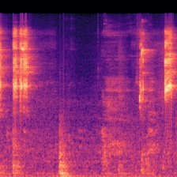

# MelSpectrumPic

#### 介绍
梅尔频谱图实现librosa的功能,提交准备好OpenCV的库,Linux系统下,Windows没测试,应该是可以用的

## 1.项目结构

```bash
.
├── data
├── librosa
│   ├── eigen3
│   ├── audio_utils.cpp
│   ├── audio_utils.h
│   ├── cv_utils.h
│   └── librosa.h
├── python
│   ├── test.py
│   └── test(1).py
├── output
│   └── 1.txt
├── Makefile
├── main.cpp
├── main.py
├── build.sh
├── README.md
└── requirements.txt
```
注:
python 中的代码为python两种实现方案,librosa和opencv出图


## 2.依赖项

- Eigen3: 项目已经支持[Eigen](librosa/eigen3)，无须安装
- OpenCV：项目用opencv出图,以便显示梅尔频谱图

## 3.Demo

```bash
    make
```

## 4.Opencv mips 编译

```
mkdir build & cd build
cmake -DCMAKE_TOOLCHAIN_FILE=../platforms/linux/mips32r5el-gnu.toolchain.cmake \
	  -D CMAKE_BUILD_TYPE=RELEASE \
      -D CMAKE_INSTALL_PREFIX=/home/incar/projects/opencv/opencv-4.9.0/install \
      -D INSTALL_C_EXAMPLES=OFF \
      -D INSTALL_PYTHON_EXAMPLES=OFF \
      -D BUILD_EXAMPLES=OFF \
      -D BUILD_SHARED_LIBS=OFF \
      -D BUILD_NEW_PYTHON_SUPPORT=OFF \
      -D BUILD_opencv_apps=OFF \
      -D BUILD_opencv_calib3d=OFF \
      -D BUILD_opencv_core=ON \
      -D BUILD_opencv_features2d=OFF \
      -D BUILD_opencv_flann=OFF \
      -D BUILD_opencv_highgui=ON \
      -D BUILD_opencv_imgcodecs=ON \
      -D BUILD_opencv_imgproc=ON \
      -D BUILD_opencv_ml=OFF \
      -D BUILD_opencv_objdetect=OFF \
      -D BUILD_opencv_photo=OFF \
      -D BUILD_opencv_stitching=OFF \
      -D BUILD_opencv_video=OFF \
      -D BUILD_opencv_videoio=ON \
      -D BUILD_opencv_viz=OFF \
	  -D BUILD_opencv_world=OFF \
	  -D BUILD_opencv_dnn=OFF \
      -D WITH_CUDA=OFF \
      -D WITH_EIGEN=OFF \
      -D WITH_FFMPEG=OFF \
      -D WITH_GSTREAMER=OFF \
      -D WITH_JASPER=OFF \
      -D WITH_JPEG=ON \
      -D WITH_WEBP=OFF \
      -D WITH_PNG=OFF \
      -D WITH_TBB=OFF \
	  -D WITH_OPENCL=OFF \
      -D WITH_TIFF=OFF \
      -D WITH_OPENEXR=OFF \
	  -D WITH_1394:BOOL=OFF \
	  -D CMAKE_C_COMPILER=mips-linux-gnu-gcc  \
	  -D CMAKE_C_FLAGS="-muclibc -mfp64 -mnan=2008 -mabs=2008 -march=mips32r2 -g -W -w -Wall -fPIC -std=c++11" \
	  -D CMAKE_CXX_COMPILER=mips-linux-gnu-g++  \
	  -D CMAKE_CXX_FLAGS="-muclibc -mfp64 -mnan=2008 -mabs=2008 -march=mips32r2 -g -W -w -Wall -fPIC -std=c++11" \
      ..
make -j4
make install
```


# 5.出图效果展示


5S_3.wav


5S.wav



1710401581_02.wav

# 6.参考资料

- [librosa](https://github.com/librosa/librosa)
- [eigen](https://gitlab.com/libeigen/eigen)
- [vo-amrwbenc](https://github.com/mstorsjo/vo-amrwbenc/blob/master/wavreader.h)
- [LibrosaCpp](https://github.com/ewan-xu/LibrosaCpp)

